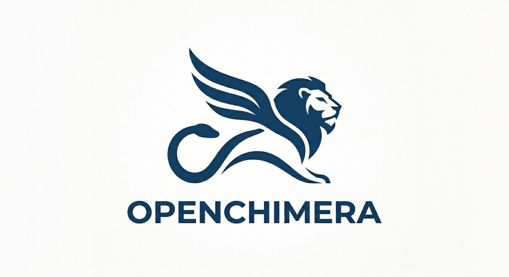

# OpenChimera



**Local-first orchestration for models, operator jobs, browser tasks, and optional external runtimes.**

OpenChimera is an open-source orchestration runtime that keeps the control plane local. It gives you one Python-native gateway for local models, reasoning services, retrieval, browser interaction, operator channels, onboarding, and supervised background jobs.

The project is designed to be safe to publish and safe to run from source: the committed runtime profile is sanitized, secrets stay out of the repository, and machine-specific overrides belong in local-only files.

## Highlights

- Local-first OpenAI-compatible provider on `http://127.0.0.1:7870`
- Managed local model routing with adaptive prompt strategy learning
- Scheduled autonomy jobs for discovery, learned fallback ranking, self-audit, degradation detection, repair previews, and dataset refresh
- MiniMind lifecycle management for reasoning and training workflows
- RAG-backed fallback answers with weighted runtime-aware retrieval
- Operator jobs, event channels, onboarding, integration audit, and browser actions
- Safe local config overrides through `config/runtime_profile.local.json`
- Structured JSONL runtime logs at `logs/openchimera-runtime.jsonl` with request correlation
- Operator CLI surface for bootstrap, onboarding, status, query sessions, memory, model roles, plugins, subsystems, MCP, and serving

## Install

Create a virtual environment and install from source:

```powershell
python -m venv .venv
.venv\Scripts\Activate.ps1
python -m pip install -r requirements-prod.txt
python -m pip install .
```

Initialize local state:

```powershell
openchimera bootstrap
```

Optional: create a local-only runtime override file at `config/runtime_profile.local.json` or point `OPENCHIMERA_RUNTIME_PROFILE` at a private profile path.

Recommended local override workflow:

```powershell
Copy-Item .\config\runtime_profile.local.example.json .\config\runtime_profile.local.json
# Edit tokens, provider activation, TLS, and local launcher paths in the local file only.
```

OpenChimera now validates local runtime profiles on load and fails fast on inconsistent settings such as enabled auth without a token, enabled TLS without both certificate paths, or a preferred cloud provider that is not also enabled.

Optional HTTPS: set `api.tls.enabled=true` plus `api.tls.certfile` and `api.tls.keyfile` in your local runtime override, or use `OPENCHIMERA_TLS_ENABLED=1`, `OPENCHIMERA_TLS_CERTFILE`, and `OPENCHIMERA_TLS_KEYFILE` for a shell-scoped launch.

## Quick Start

Run the local diagnostics first:

```powershell
openchimera doctor
openchimera onboard
```

Start the runtime:

```powershell
openchimera serve
```

Query status from another shell:

```powershell
openchimera status --json
Invoke-RestMethod -Method Get -Uri http://127.0.0.1:7870/health
Invoke-RestMethod -Method Get -Uri http://127.0.0.1:7870/v1/system/readiness
Invoke-RestMethod -Method Get -Uri http://127.0.0.1:7870/openapi.json
```

If TLS is enabled, use `https://127.0.0.1:7870` instead. OpenChimera fails fast on invalid certificate configuration rather than silently falling back to plain HTTP.

Runtime logs are emitted to the console and, by default, to `logs/openchimera-runtime.jsonl` as structured JSON lines. Use `OPENCHIMERA_LOG_LEVEL`, `OPENCHIMERA_STRUCTURED_LOG_ENABLED`, or `OPENCHIMERA_STRUCTURED_LOG_PATH` to override the log level or file destination for a deployment.

Exposed deployments should not bind beyond localhost without auth. If you set `OPENCHIMERA_HOST=0.0.0.0` or any non-loopback host, also set `OPENCHIMERA_API_TOKEN` and `OPENCHIMERA_ADMIN_TOKEN`.

## Containers

OpenChimera now ships with a first-class container path for Docker Desktop, Linux hosts, or CI smoke deployments.

Build the image:

```powershell
docker build -t openchimera:local .
```

Run the container directly:

```powershell
docker run --rm -p 7870:7870 \
  -e OPENCHIMERA_HOST=0.0.0.0 \
  -e OPENCHIMERA_API_TOKEN=replace-with-user-token \
  -e OPENCHIMERA_ADMIN_TOKEN=replace-with-admin-token \
  -e OPENCHIMERA_PORT=7870 \
  -v ${PWD}\config\runtime_profile.local.json:/app/config/runtime_profile.local.json:ro \
  -v openchimera-data:/app/data \
  -v openchimera-logs:/app/logs \
  -v openchimera-models:/app/models \
  openchimera:local
```

Or use Compose:

```powershell
Copy-Item .env.example .env
# Edit .env and set OPENCHIMERA_API_TOKEN plus OPENCHIMERA_ADMIN_TOKEN first.
docker compose up --build -d
docker compose ps
docker compose logs -f openchimera
```

Container defaults:

- the runtime binds to `0.0.0.0:7870` inside the container
- the container path expects `OPENCHIMERA_API_TOKEN` and `OPENCHIMERA_ADMIN_TOKEN` to be set before startup
- data, logs, and models are persisted through named volumes
- `config/runtime_profile.local.json` is mounted read-only so deployment secrets and machine-specific roots stay out of the image
- the image healthcheck probes `/health` locally inside the container
- if you intentionally need an unauthenticated non-loopback bind in an isolated lab, set `OPENCHIMERA_ALLOW_INSECURE_BIND=1` explicitly instead of relying on implicit insecure defaults

## Deployment

The deployment helpers below are source-checkout utilities. They are present in the repository and source distribution, but they are not installed into your working directory by the `openchimera` wheel entry point.

For a persistent Windows host, use the built-in Task Scheduler deployment path instead of launching the server manually in a shell.

Install the startup task from an elevated PowerShell session:

```powershell
powershell -ExecutionPolicy Bypass -File .\scripts\install-openchimera-task.ps1
```

This registers a startup task named `OpenChimera` that:

- runs `scripts\start-openchimera.ps1`
- starts the runtime from the repository root
- appends process output to `logs\openchimera-task.log`
- restarts automatically after failures with a one-minute interval

Useful operations:

```powershell
Get-ScheduledTask -TaskName OpenChimera
Start-ScheduledTask -TaskName OpenChimera
Get-Content .\logs\openchimera-task.log -Tail 100
powershell -ExecutionPolicy Bypass -File .\scripts\remove-openchimera-task.ps1
```

If you prefer to run under a specific service account instead of `SYSTEM`, pass `-RunAsUser` when installing the task.

For repository automation, GitHub Actions now treats OpenChimera as a Python service release:

- `.github/workflows/python-ci.yml` runs the curated release validation gate on Windows and Ubuntu, then performs a separate Ubuntu full-discovery unittest sweep before package build checks.
- `.github/workflows/deploy.yml` builds `sdist` and wheel artifacts, smoke-installs them on Windows and Ubuntu, and publishes a GitHub release when you push a version tag like `v0.1.0`.

For local operator and developer validation, use the repo-native quality gate scripts so the same checks are easy to run outside CI:

`python run.py validate` now executes the curated release validation suite defined in `config/release_validation_modules.txt` with a concise success summary by default, including a short doctor-warning digest and bounded remediation hints when the runtime configuration is degraded.
Use `python run.py validate --verbose-tests` when you want raw unittest output streamed live, or `python run.py validate --pattern test_*.py` when you explicitly want the full unittest discovery sweep.
`python run.py validate --json` now emits a compact automation-friendly payload by default, including machine-readable test metrics such as counts and duration; add `--include-test-output` when you need the full captured unittest stdout and stderr in the JSON response.

```powershell
powershell -ExecutionPolicy Bypass -File .\scripts\run-quality-gate.ps1
powershell -ExecutionPolicy Bypass -File .\scripts\run-quality-gate.ps1 -SkipPreCommit -TestPattern test_cli.py
```

```bash
./scripts/run-quality-gate.sh
./scripts/run-quality-gate.sh --skip-pre-commit --pattern test_cli.py
```

## CLI

OpenChimera now ships with a small first-class CLI:

```powershell
openchimera bootstrap
openchimera doctor
openchimera config --json
openchimera onboard
openchimera capabilities
openchimera tools
openchimera query --text "summarize the current runtime"
openchimera sessions
openchimera memory
openchimera model-roles
openchimera plugins
openchimera subsystems
openchimera mcp
openchimera briefing
openchimera autonomy
openchimera jobs
openchimera status --json
openchimera serve
```

Command summary:

- `openchimera bootstrap` creates missing local directories and baseline JSON state.
- `openchimera doctor` checks config sources, auth state, and optional integration roots without printing secret values.
- `openchimera doctor` now also prints bounded next-action guidance for common degraded states such as missing GGUF assets, unsupported harness roots, or unsafe public binds.
- `openchimera config` prints the sanitized effective configuration snapshot, including deployment mode, auth state, TLS state, structured logging, and override-profile status.
- `openchimera onboard` shows onboarding completion, blockers, and next actions.
- onboarding can persist a `prefer_free_models` preference so fallback planning can bias no-cost models before paid providers.
- `openchimera capabilities` lists commands, tools, skills, plugins, and MCP inventory.
- `openchimera tools` lists validated runtime tools, inspects one tool contract, or executes a tool with explicit JSON arguments, including autonomy jobs and autonomy artifact inspection.
- `openchimera query` runs work through the query engine with resumable sessions and can execute explicit tool requests before completion when you pass `--execute-tools` with one or more `--tool-request-json` payloads.
- `openchimera sessions` inspects persisted query sessions.
- `openchimera memory` shows hydrated user, repo, and session memory summaries.
- `openchimera model-roles` inspects or overrides explicit model-role routing.
- `openchimera plugins` inspects or changes plugin installation state.
- `openchimera subsystems` inspects or invokes managed subsystem contracts.
- `openchimera mcp` shows discovered MCP servers and their health.
- `openchimera mcp --serve` exposes a local stdio MCP server so OpenChimera can be consumed as an MCP provider, not just report external MCP inventory.
- `openchimera mcp --registry` shows OpenChimera-managed MCP connectors together with their last-known probe state.
- `openchimera mcp --register ...` and `openchimera mcp --unregister ...` manage registry-backed HTTP or stdio connectors without editing manifests by hand.
- `openchimera mcp --probe [--id ...]` runs health checks for one or all managed MCP connectors and persists the result into `data/mcp_health_state.json`.
- `openchimera mcp --resources` and `openchimera mcp --prompts` render the native OpenChimera MCP resource and prompt descriptors.
- `openchimera briefing` renders the operator daily briefing, including learned free-fallback leaders and degraded fallback warnings.
- `openchimera channels` inspects configured channel subscriptions, can create or delete subscriptions from JSON/id arguments, can dispatch a test payload to any topic, and can query recent channel delivery history filtered by topic or result status.
- `openchimera autonomy` inspects autonomy diagnostics, reads autonomy artifact history and snapshots, runs explicit autonomy jobs, or stages preview-only repair plans from the CLI.
- `openchimera jobs` shows durable operator jobs, filters them by status or type, inspects one job by id, and can cancel or replay them.
- `openchimera status` prints a local runtime snapshot without starting the API server.
- `openchimera serve` boots the kernel and hosted API.
- `scripts/run-quality-gate.ps1` and `scripts/run-quality-gate.sh` run the local hygiene and validation gate in one step.

## API Surface

Selected routes:

- `GET /openapi.json`
- `GET /docs`
- `GET /health`
- `GET /v1/system/readiness`
- `GET /v1/system/status`
- `GET /v1/system/metrics`
- `GET /v1/config/status`
- `GET /v1/auth/status`
- `GET /v1/credentials/status`
- `GET /v1/channels/status`
- `GET /v1/channels/history`
- `GET /v1/onboarding/status`
- `GET /v1/model-registry/status`
- `GET /v1/providers/status`
- `GET /v1/tools/status`
- `GET /v1/autonomy/diagnostics`
- `GET /v1/autonomy/artifacts/history`
- `GET /v1/autonomy/artifacts/get`
- `GET /v1/autonomy/operator-digest`
- `GET /v1/model-roles/status`
- `GET /v1/capabilities/status`
- `GET /v1/capabilities/commands`
- `GET /v1/capabilities/tools`
- `GET /v1/capabilities/skills`
- `GET /v1/capabilities/plugins`
- `GET /v1/capabilities/mcp`
- `POST /v1/tools/execute`
- `GET /v1/mcp/status`
- `GET /v1/mcp/registry`
- `GET /mcp`
- `GET /v1/query/status`
- `GET /v1/query/sessions`
- `GET /v1/query/memory`
- `GET /v1/plugins/status`
- `GET /v1/subsystems/status`
- `GET /v1/jobs/get`
- `GET /v1/browser/status`
- `POST /v1/browser/fetch`
- `POST /v1/browser/submit-form`
- `POST /v1/runtime/start`
- `POST /v1/runtime/stop`
- `POST /v1/model-roles/configure`
- `POST /v1/query/run`
- `POST /v1/query/session/get`
- `POST /v1/plugins/install`
- `POST /v1/plugins/uninstall`
- `POST /v1/subsystems/invoke`
- `POST /v1/channels/dispatch`
- `POST /v1/jobs/create`
- `POST /v1/autonomy/preview-repair`
- `POST /v1/autonomy/operator-digest/dispatch`
- `POST /v1/mcp/registry/set`
- `POST /v1/mcp/registry/delete`
- `POST /v1/mcp/probe`
- `POST /mcp`

MCP integration notes:

- the repo now includes a root `.mcp.json` manifest that declares `openchimera-local`.
- capability discovery scans `.mcp.json` manifests as well as health-state entries, so self-declared MCP servers show up in `openchimera mcp --json`.
- OpenChimera-managed connectors now have a first-class registry in `data/mcp_registry.json`, and probe outcomes are persisted separately in `data/mcp_health_state.json` so discovery and liveness stay independently observable.
- `openchimera-local` currently exposes operator-focused tools for daily briefing, autonomy diagnostics, operator digest access/dispatch, MCP registry inspection/probing, and channel status/history through the native stdio MCP server.
- the hosted API now also serves the same MCP methods at `/mcp`, and the descriptor returned by `GET /mcp` includes tool, resource, and prompt counts for HTTP consumers.
- managed MCP connectors are also exposed through `/v1/mcp/registry`, `/v1/mcp/registry/set`, `/v1/mcp/registry/delete`, and `/v1/mcp/probe`, so automation can manage the connector mesh without going through the CLI.
- the hosted API now also exposes a public human-readable docs page at `/docs` and a machine-readable OpenAPI-style contract at `/openapi.json`.

## Configuration

Committed config is intentionally safe and generic:

- `config/runtime_profile.json` contains publishable defaults only.
- `config/runtime_profile.local.json` is the preferred place for machine-specific roots, model paths, and private overrides.
- `GET /v1/config/status` and `openchimera config --json` expose the effective sanitized configuration without leaking secret values.
- `OPENCHIMERA_RUNTIME_PROFILE` can point to an external private profile file.
- `.env.example` contains placeholders only and should not contain real tokens.

Autonomy defaults now include:

- `autonomy.jobs.discover_free_models` for probing free or no-cost fallback catalogs
- `autonomy.jobs.sync_scouted_models` for merging legacy fallback manifests with current discovery results
- `autonomy.jobs.learn_fallback_rankings` for converting route-memory outcomes into learned free-fallback ordering and degradation signals
- `autonomy.jobs.check_degradation_chains` for detecting broken runtime/fallback chains before they turn into silent drift
- `autonomy.jobs.run_self_audit` for building a consolidated runtime audit across providers, subsystems, jobs, and integration gaps
- `autonomy.jobs.preview_self_repair` for packaging a preview-only repair plan with Aegis-oriented recommendations
- `autonomy.jobs.dispatch_operator_digest` for rolling recent alerts, failed durable jobs, and failed channel deliveries into a scheduled operator digest
- `autonomy.artifacts.retention.max_history_entries` and `autonomy.artifacts.retention.max_age_days` for pruning stale autonomy artifact history without deleting current snapshots
- `autonomy.alerts.dispatch_topic` and `autonomy.alerts.minimum_severity` for routing severe autonomy findings into operator channels
- `autonomy.digests.dispatch_topic` and `autonomy.digests.history_limit` for tuning where operator digests are published and how much recent operator history they summarize
- `providers.prefer_free_models` for biasing fallback recommendations toward no-cost models without changing the local-first default

The new diagnostics and preview surfaces are intentionally non-destructive:

- `GET /v1/autonomy/diagnostics` returns the current scheduler status plus the latest autonomy artifacts such as self-audit, degradation chains, and repair previews.
- `GET /v1/autonomy/artifacts/history` returns recent artifact generations so operators can inspect audit/repair history instead of just the latest snapshot.
- `GET /v1/autonomy/artifacts/get` reads one current autonomy artifact by name.
- `GET /v1/autonomy/operator-digest` reads the latest rolled-up operator digest artifact directly without going through generic artifact lookup.
- `POST /v1/autonomy/preview-repair` can either generate a fresh preview immediately or enqueue it as a durable operator job when `enqueue=true` is supplied.
- `POST /v1/autonomy/operator-digest/dispatch` generates or queues the operator digest with optional `history_limit`, `dispatch_topic`, and `enqueue` controls.
- `openchimera autonomy --run-job dispatch_operator_digest` generates the current operator digest immediately and writes the `operator_digest` artifact under `data/autonomy`.
- `openchimera autonomy --operator-digest` reads the current digest artifact, and `openchimera autonomy --dispatch-digest` exposes the digest dispatch path without requiring a raw job name.
- queued autonomy jobs are now classified into explicit job types such as `autonomy.audit`, `autonomy.learning`, and `autonomy.preview_repair` so filtering and replay can target real operator workflows.
- severe degradation and self-audit findings now emit a dedicated `system/autonomy/alert` channel event so Slack, Discord, Telegram, or webhook subscribers can receive proactive operator alerts instead of polling artifacts.
- scheduled operator digests reuse the daily briefing channel surface by default and include recent autonomy alerts, failed durable jobs, and failed channel deliveries so operators can see the current failure picture in one dispatch.
- `POST /v1/channels/dispatch` and `openchimera channels --dispatch-topic ...` let operators push a manual payload to any configured topic for alert smoke-tests, webhook verification, or custom operator broadcasts.
- `GET /v1/channels/history` and `openchimera channels --history ...` expose a bounded persisted delivery log with compact payload previews so failed webhook and alert deliveries can be inspected after the fact without tailing runtime output.

Recovered architecture enhancements from legacy archaeology are being absorbed as roadmap inputs for autonomy, routing, and operator ergonomics. They are not promoted to standalone subsystem entries unless OpenChimera has a stable runtime contract for them.

Authentication uses either environment variables or the local credential store:

- `OPENCHIMERA_API_TOKEN`
- `OPENCHIMERA_ADMIN_TOKEN`
- `OPENCHIMERA_API_AUTH_HEADER`
- `OPENCHIMERA_HOST`
- `OPENCHIMERA_PORT`
- `OPENCHIMERA_MINIMIND_PYTHON`

Optional real multimodal backends:

- Windows speech transcription and synthesis require a Windows host with `System.Speech` available.
- `OPENAI_API_KEY` enables real image generation and can also be used for vision analysis.
- `OPENROUTER_API_KEY` enables real vision analysis when configured.

The CLI and API status surfaces report whether auth is configured, but they do not print raw token values.

## Optional Integrations

OpenChimera can supervise or inspect optional external components when you provide local paths for them:

- AETHER
- WRAITH
- Project Evo
- MiniMind
- upstream harness Python port
- legacy workflow snapshots for compatibility evidence
- Aegis and Ascension-related workspaces

These integrations are optional. A clean source checkout still boots in degraded mode without them.

See `LEGACY_INTEGRATIONS.md` for the neutral compatibility and evidence model.

## Security

This repository is intended to stay open-source friendly:

- no committed secrets
- no committed workstation-specific tokens
- sanitized default runtime profile
- local override file support for private paths and credentials
- credential status surfaces that do not leak raw values

See `SECURITY.md` for reporting guidance and repository hygiene expectations.

## Open Source

OpenChimera is licensed under the MIT License. The runtime is designed so contributors can clone the repo, install it from source, bootstrap missing state, and run it locally without inheriting another machine's private configuration.

If you are contributing, keep private overrides out of committed files and prefer local-only config files or environment variables for any credentialed provider setup.
